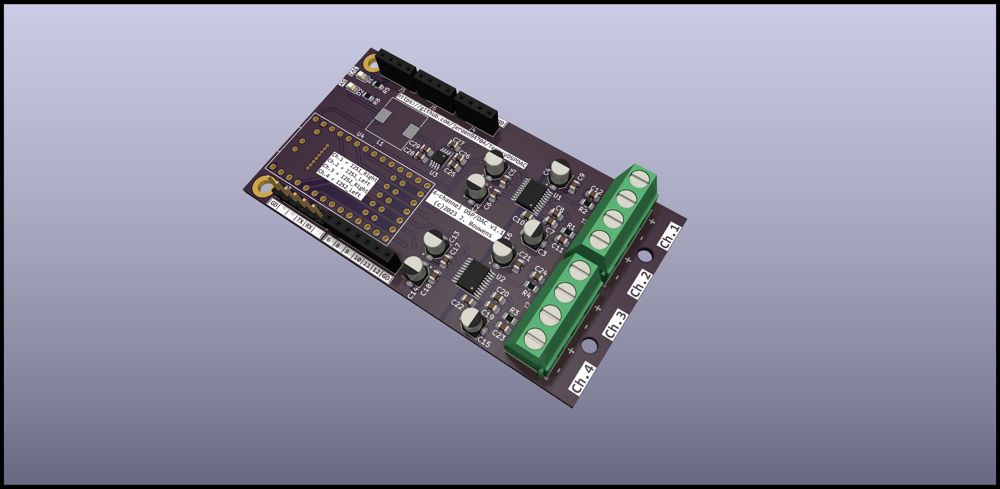

# Introduction

# **WARNING** This design is currently (2023-10-21) being produced and hence untested. It might not function at all.

This board is intended as a decent 4-channel USB DAC with advanced DSP capabilities. The DSP functionality is provided by a Teensy 4.0 and the DAC stage is built around a pair of TI PCM5102A's.

The Teensy's UART1, I2C0 and I2C1 ports are available through dedicated pin-headers. The UART is compatible with an FTDI 6-pin dupont connector (although, inevitably, RX and TX are the wrong way around). The I2C headers are pin-compatible with those ubiquitous I2C OLED display modules. The remaining unused Teensy pins are broken out on a pair of pin-headers on both sides of the board.

This DSP/DAC is a companion project to [my take on the HexiBase mini-subwoofer](https://www.printables.com/model/609048-hexibase-3d-printed-mini-subwoofer-redux). I wanted a way to properly match that sub to the pair KEF Q150's I use as desktop speakers, and this seemed like a fun project to do myself. I'm not an electronics engineer, so this is completely based off of the reference circuits in the respective components' datasheets.

# Programming the DSP

DSP functionality can be designed using [PJRC's Audio System Design Tool](https://www.janbob.com/electron/OpenAudio_Design_Tool/index.html) or (for 32-bit floating point DSP) [Chip Audette's OpenAudio F32 Design Tool](https://www.janbob.com/electron/OpenAudio_Design_Tool/index.html). The code generated by these tools is not a complete Arduino Sketch, but can be copy-pasted into an existing sketch. For example, below is a design of a DSP for a 2.1 speaker setup. It takes a USB stereo input signal and creates a separate subwoofer channel with just the low frequencies:

This design results in the following code:

    #include <Audio.h>
    #include <Wire.h>
    #include <SPI.h>
    #include <SD.h>
    #include <SerialFlash.h>

    // GUItool: begin automatically generated code
    AudioInputUSB            usb1;           //xy=167.1666717529297,283.1666564941406
    AudioFilterStateVariable filter2;        //xy=403.16668701171875,341.16668701171875
    AudioFilterStateVariable filter1;        //xy=407.16668701171875,218.16665649414062
    AudioMixer4              mixer1;         //xy=569.1666870117188,284.1666564941406
    AudioOutputI2S2          i2s2_1;         //xy=718.1666870117188,347.16668701171875
    AudioOutputI2S           i2s1;           //xy=721.1666870117188,231.16665649414062
    AudioConnection          patchCord1(usb1, 0, filter1, 0);
    AudioConnection          patchCord2(usb1, 1, filter2, 1);
    AudioConnection          patchCord3(filter2, 0, mixer1, 1);
    AudioConnection          patchCord4(filter2, 2, i2s2_1, 0);
    AudioConnection          patchCord5(filter1, 0, mixer1, 0);
    AudioConnection          patchCord6(filter1, 2, i2s1, 0);
    AudioConnection          patchCord7(mixer1, 0, i2s1, 1);
    // GUItool: end automatically generated code

# Programming the Teensy

The code generated by the Design Tool can be pasted into an existing Arduino sketch after [downloading and installing Teensyduino](https://www.pjrc.com/teensy/td_download.html). The variable declarations are enough to start the DSP process, so if all you want is audio then the only thing you need to add are a setup() function that calls [AudioMemory](https://www.pjrc.com/teensy/td_libs_AudioConnection.html) and an empty loop() function. So given the above code, the complete sketch could be as simple as:

    #include <Audio.h>
    #include <Wire.h>
    #include <SPI.h>
    #include <SD.h>
    #include <SerialFlash.h>

    // GUItool: begin automatically generated code
    AudioInputUSB            usb1;           //xy=167.1666717529297,283.1666564941406
    AudioFilterStateVariable filter2;        //xy=403.16668701171875,341.16668701171875
    AudioFilterStateVariable filter1;        //xy=407.16668701171875,218.16665649414062
    AudioMixer4              mixer1;         //xy=569.1666870117188,284.1666564941406
    AudioOutputI2S2          i2s2_1;         //xy=718.1666870117188,347.16668701171875
    AudioOutputI2S           i2s1;           //xy=721.1666870117188,231.16665649414062
    AudioConnection          patchCord1(usb1, 0, filter1, 0);
    AudioConnection          patchCord2(usb1, 1, filter2, 1);
    AudioConnection          patchCord3(filter2, 0, mixer1, 1);
    AudioConnection          patchCord4(filter2, 2, i2s2_1, 0);
    AudioConnection          patchCord5(filter1, 0, mixer1, 0);
    AudioConnection          patchCord6(filter1, 2, i2s1, 0);
    AudioConnection          patchCord7(mixer1, 0, i2s1, 1);
    // GUItool: end automatically generated code

    void setup() 
    {
        AudioMemory(12);
    }

    void loop() 
    {
    }

If you want to add more functionality, such as controls (buttons, dials) or a display you can implement this in the same sketch.

# Cost

It's a pretty compact board (87x47mm, or about 3.42" x 1.85"), so getting the bare PCB fabricated by one of the large cheap Chinese PCB manufacturers is very affordable. For reference, I would have paid ~€3 for 5 boards (€0.60 per board). However, as an experiment I decided to try the assembly service they offer. With the through hole and pricier SMD (DACs and voltage regulator) components omitted this came to a total of ~€27 for 5 partially populated boards (€5.40 per board). The remaining components (excluding the pinheaders and screw terminals, which I have in stock by default) cost about :

- Teensy 4.0: €27
- 2x PCM5102A DAC: €3.40
- 1x LT1962 3.3V regulator: €1.85
- USB-C port: €1

So the total is about €40 for components + partial assembly. Now you can't order just 1 board, so it's more expensive than that, but if you do all soldering yourself I expect you would save at another €10 or so. Now this is not on par with high-end audio gear, of course, but given that many consumer-grade USB DACs use the same DAC chip, and the DSP features are similar to something like a miniDSP I'd say this is a pretty good deal.

# Enclosure and Amplifier

The board has mounting holes for installation in an enclosure, but they are not placed to fit any particular model. If you use a metal enclosure make sure is is connected to the plated mounting holes (on the Teensy/USB-C port side of the board), which connects to the protective earth of the USB-C port.

For my own build I plan to create a custom, 3D-printed enclosure and I will add a link to that design once it's done.

While it's probably superfluous to mention this for most: The output of this board is a line-level signal, so you need to add an amplifier before you can hook up speakers. Which amplifier(s) to get is up to you and beyond the scope of this document. There are MANY 1-, 2- and 4-channel amplifiers to choose from, either in module-form (for integration into your own DSP+DAC+AMP) or standalone off-the-shelf.

# Donate

If you find this project useful a small donation is much appreciated (but by no means required or expected): https://ko-fi.com/jeroen94704

# License 

This design is ©2023 Jeroen Bouwens and is licensed under CC BY-NC-SA 4.0. To view a copy of this license, visit http://creativecommons.org/licenses/by-nc-sa/4.0/
